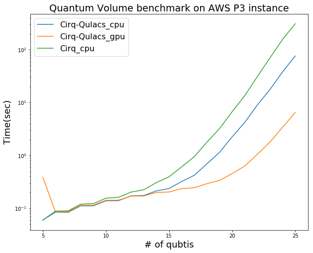

# Cirq-Qulacs

## Feature

- Fast quantum circuit simulation on Cirq with qulacs backend
- It also supports CUDA for high performance simulation

## Performance
### Test enviornment
- Depth 8 Quantum Volume circuit generated by [openqasm](https://github.com/Qiskit/openqasm)
- Nvidia Tesla V100
- Intel Xeon E5-2690v4
- Circuit compression disabled



## Installation

### Requirements

- [Cirq](https://github.com/quantumlib/Cirq)
- [Qulacs](https://github.com/qulacs/qulacs.git)

### Install cirq-qulacs from source

Install
```
git clone https://github.com/qulacs/cirq-qulacs.git
cd cirq-qulacs
python setup.py install
```

Uninstall
```
pip uninstall cirqqulacs
```

## Sample code
### CPU
```python
import cirq
from cirqqulacs import QulacsSimulator

qubit_n = 3
qubits = [cirq.LineQubit(i) for i in range(qubit_n)]
circuit = cirq.Circuit()
circuit.append(cirq.ops.X(qubits[0]))
circuit.append(cirq.ops.Rx(np.pi/5.5).on(qubits[1]))
circuit.append(cirq.ops.CCZ(qubits[0], qubits[1], qubits[2]))
result = QulacsSimulator().simulate(circuit)
```
### GPU
```python
import cirq
from cirqqulacs import QulacsSimulatorGpu

qubit_n = 3
qubits = [cirq.LineQubit(i) for i in range(qubit_n)]
circuit = cirq.Circuit()
circuit.append(cirq.ops.X(qubits[0]))
circuit.append(cirq.ops.Rx(np.pi/5.5).on(qubits[1]))
circuit.append(cirq.ops.CCZ(qubits[0], qubits[1], qubits[2]))
result = QulacsSimulatorGpu().simulate(circuit)
```

## License

MIT License (see `LICENSE` file).
